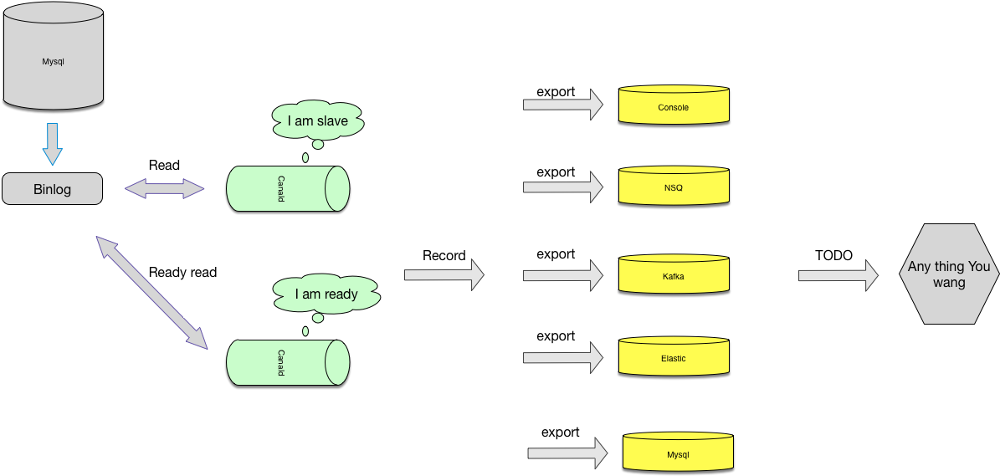
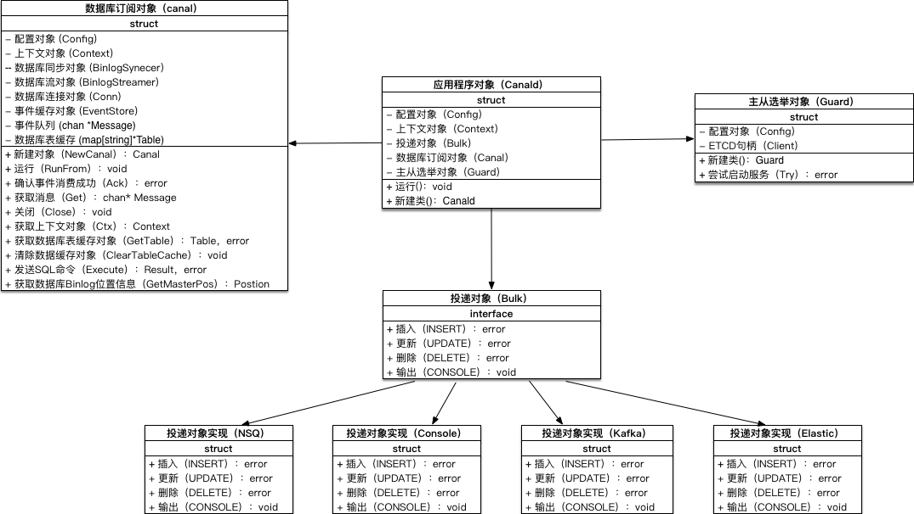
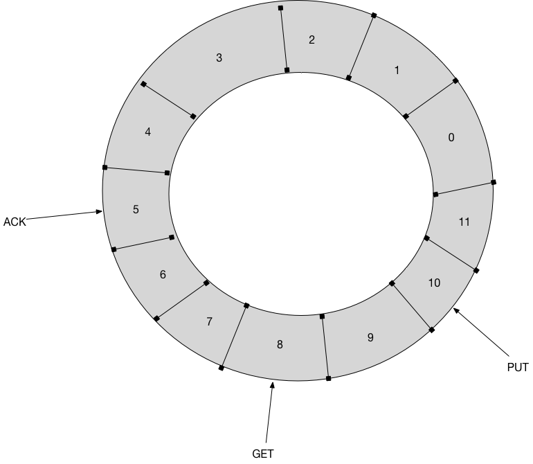

# virgo

    virgo 是mysql数据库binlog的增量订阅组件canald 和 运维工具canalctl 的集合。

## 特性
- 并发
- 主从切换
- dump工具
- 保证binlog事件不丢
- 支持配置文件和命令行启动
- 多平台支持 macOs，linux，windows。
- 轻量，无任何依赖
- 支持多个消费组件，NSQ，Kafka，Elastic,MNS

## 架构设计

## 类图设计

## EventStore设计

## NOTICE
主从功能未测试